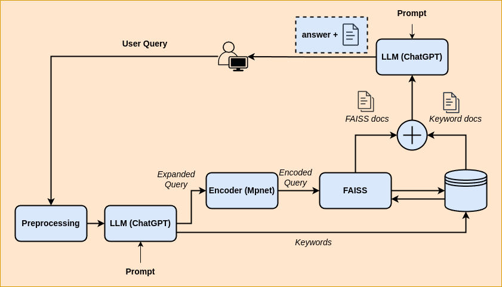

<div style="text-align: center;">
    
</div>

# Simple Wiki Oracle

Simple Wiki Oracle is a tool to answer your questions from the dataset [Simple English Wiki](https://huggingface.co/datasets/wikipedia) which contains ~200K articles written in simplified English. The same Hugginface dataset collection contains much larger datasets but for this assignment I used the smallest one for practical reasons. Note that the same methods used in this code base can equally be used for larger datasets.

## System Workflow

1) **User Query Processing**

The system accepts a user's query via command-line arguments.
It uses NLTK to download stopwords, which are used in text processing and filtering.
Model and Index Setup:

2) **Query Expansion and Parsing**

The user query is expanded and processed using an LLM (e.g., ChatGPT-3.5 or an equivalent open-source LLM).
The output from the LLM is parsed to extract entities, relations, and a summary.

3) **Article Retrieval using FAISS**

The system uses the expanded query to find similar articles from the FAISS index.
It performs a similarity search in the index and retrieves the top relevant articles.

4) **Keyword Search in Articles**

In parallel, a keyword search based on extracted entities is performed directly in the wiki database.
This ensures the retrieval of additional relevant articles.

5) **Combining Search Results**

The articles retrieved from both FAISS and keyword search are merged to form a comprehensive knowledge base.

6) **Answer Extraction**

The final knowledge base is used to extract a specific answer to the user query.
The system queries the LLM with the knowledge base to get a precise answer.

7) **Output Presentation**

The answer, along with the index of the relevant article in the knowledge base, is outputted.
Users receive both the direct answer to their query and the source article from the wiki database.

<div style="text-align: center;">
    
</div>

## Instruction for local setup

### Requirements
For local setup, You need python 3 (I have tried 3.9 but it probably can work with other versions too.). I included two requirement files:
1) *requirements_MacM1.txt* : I used this one on my Mac M1 laptop.

2) *requirements_Ubuntu_gpu.txt* : I used this one for my Ubuntu machine with Nvidia GPU.
Depending on what machine you are using you can install the requirements using the following commands:

- For Mac M1:
```
pip install -r requirements_MacM1.txt
```
- For Ubuntu with Nvidia GPU:
```
pip install -r requirements_Ubuntu_gpu.txt
```
Of course I assume you do this in a virtual environment (You better!)

### Open API key
In this code I use chatGPT-3.5 model through [Open AI](https://openai.com/product) API for expanding the query and extracting the answer. You need to get an API key from Open AI, create a file names *.env* and put the key in it. The file should look like this:
```
OPEN_AI_API_KEY = "sk-xxxxxxxxxxxxxxxxxxxxxxxxxxxxxxxxxxxxxxxxxxxxxxxx"
```
The code can access the key from this file. 

### Data location
For running these codes you need couple of datasets. These datasets where too large to be included in the repository. You can download them from my [One Derive folder](https://1drv.ms/f/s!AuFmXHbKvaqzjfhxqfGNjK9x-VogdA?e=Q33uCy). 
Let me know if you have issue with downloading the files. Here are the files in this folder:
1) *wiki_simple.csv* : This the original dataset from Huggingface. You wont need this file but I included it for reference.

2) *wiki_simple_text.csv* : This is the dataset that I created by keeping only the text column of the original dataset.

3) *article_vectors.npy* :
This is the vector set I created using encoder (Bert) model. If you want to see how I created this check faiss_bert_implementation.ipynb notebook which was my exploratory notebook for this project.

4) *faiss_index.idx* : This is the index file that I created for the vectors in the previous file. If you want to see how I created this check faiss_bert_implementation.ipynb notebook which was my exploratory notebook for this project. 

5) *article_vectors_mpnet.npy* :
This is the vector set I created using encoder (mpnet) model. If you want to see how I created this check faiss_bert_implementation_better_llm.ipynb notebook which was my exploratory notebook for this project.

6) *faiss_index_mpnet.idx* : This is the index file that I created for the vectors in the previous file (using mpnet). If you want to see how I created this check faiss_bert_implementation_better_llm.ipynb notebook which was my exploratory notebook for this project. 

## How to run the code
To run the code you need to activate the virtual environment and install the requirements as I explained above then run the command in this format: 
```
python simple_wiki_oracle.py <query> 
```
Example:

```
python simple_wiki_oracle.py "css flex"
```